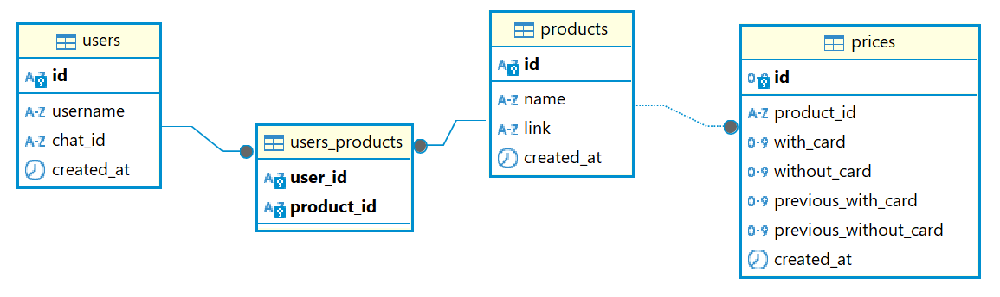

# Pricely


Telegram-бот для мониторинга цен на товары в интернет-магазинах. Автоматически отслеживает изменения цен и отправляет уведомления пользователям через Telegram.

## Возможности

- Отслеживание цен на товары по ссылке
- Автоматическая периодическая проверка цен по расписанию (cron)
- Уведомления в Telegram при изменении цены
- Поддержка прокси для парсинга
- Групповая рассылка уведомлений

## Стек технологий

- **Язык:** Python 3.13+
- **Telegram:** aiogram 3
- **Парсинг:** Playwright (Chromium)
- **БД:** PostgreSQL 16, SQLAlchemy 2, Alembic
- **Очередь:** Redis 7
- **Планировщик:** APScheduler
- **Контейнеризация:** Docker, Docker Compose

## Архитектура

Проект построен на принципах Clean Architecture:

```
├── domain/           # Бизнес-сущности и доменные сервисы
├── application/      # Use cases и интерфейсы репозиториев
├── infrastructure/   # Реализация: БД, парсер, Redis
├── presentation/     # Telegram-бот (хэндлеры, клавиатуры)
└── checker_main.py   # Точка входа сервиса проверки цен
```

### Схема базы данных



## Развертывание

### Предварительные требования

- [Docker](https://docs.docker.com/get-docker/) и [Docker Compose](https://docs.docker.com/compose/install/)

### Установка

1. Клонировать репозиторий:

   ```bash
   git clone https://github.com/heavenyoung1/pricely.git
   cd pricely
   ```

2. Создать файл `.env` на основе `.env.example` и заполнить значения:

   ```bash
   cp .env.example .env
   ```

   Переменные .env:

   - `CHECKER_CRON` — расписание проверки цен в формате cron (например, `'0 */6 * * *'` — каждые 6 часов)

3. Собрать и запустить все сервисы:

   ```bash
   docker compose up -d --build
   ```

   Будут запущены:

   | Сервис    | Описание                              |
   |-----------|---------------------------------------|
   | `db`      | PostgreSQL 16                         |
   | `redis`   | Redis 7                               |
   | `migrate` | Применение миграций Alembic           |
   | `bot`     | Telegram-бот                          |
   | `checker` | Сервис периодической проверки цен     |

4. Проверить статус сервисов:

   ```bash
   docker compose ps
   ```

5. Посмотреть логи:

   ```bash
   docker compose logs -f bot checker
   ```

## Полезные команды

### Сборка

```bash
# Собрать все образы
docker compose build

# Собрать конкретный сервис
docker compose build bot

# Собрать без кэша (полная пересборка)
docker compose build --no-cache
```

### Запуск и остановка

```bash
# Запустить все сервисы
docker compose up -d

# Собрать и запустить (если были изменения в коде)
docker compose up -d --build

# Остановить все сервисы
docker compose down

# Остановить и удалить volumes (БД, Redis)
docker compose down -v
```

### Перезапуск

```bash
# Перезапустить все сервисы
docker compose restart

# Перезапустить конкретный сервис
docker compose restart bot
docker compose restart checker

# Пересобрать и перезапустить один сервис (после изменения кода)
docker compose up -d --build bot
```

### Логи

```bash
# Логи всех сервисов
docker compose logs

# Логи конкретного сервиса в реальном времени
docker compose logs -f bot
docker compose logs -f checker

# Последние 100 строк логов
docker compose logs --tail 100 bot
```

## Лицензия

[MIT](LICENSE)
